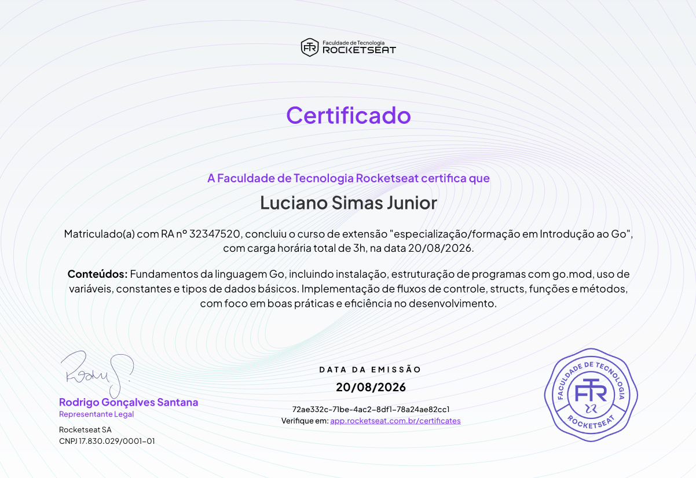

## **Introdução a Linguagem GO**

> Este repositório está sendo alimentado com base no curso de [Introdução a Linguagem GO da Rocketseat](https://app.rocketseat.com.br/jornada/go-curso-introdutorio/visao-geral), que tem o foco de nos ensinar sobre a sintaxe do Golang.

### **Fundamentos e Sintaxe em GO:**

#### **Para rodar os códigos:** go run pastaDoArquivo/arquivo.go

- [Variáveis](Fundamentos/Variaveis/main.go)
- [Estruturas de Decisão](Fundamentos/Decisoes/main.go)
- [Arrays](Fundamentos/Arrays/main.go)
- [Estrutura de Repetição](Fundamentos/Repeticao/main.go)
- [Structs](Fundamentos/Structs/main.go)
- [Funções](Fundamentos/Funcoes/main.go)
- [Métodos](Fundamentos/Metodos/main.go)
- [Ponteiros](Fundamentos/Ponteiros/main.go)
- **Concorrência**
    - [Gorountines](Fundamentos/Concorrencia/Goroutines/main.go)
    - [Gorountines Sem Ordem](Fundamentos/Concorrencia/GoroutinesSemOrdem/main.go)
    - [Channels](Fundamentos/Concorrencia/Channels/main.go)

> ### **Projeto - Quiz em GO** 
> **[Jogo de Perguntas e Repostas](main.go)** - Desenvolvido para jogar no terminal, contém soma de pontuação para perguntas acertadas, interação com usúario e manipulação de strings. 

## **Certificado de Conclusão do Curso de Introdução ao GO da Rocketseat**

